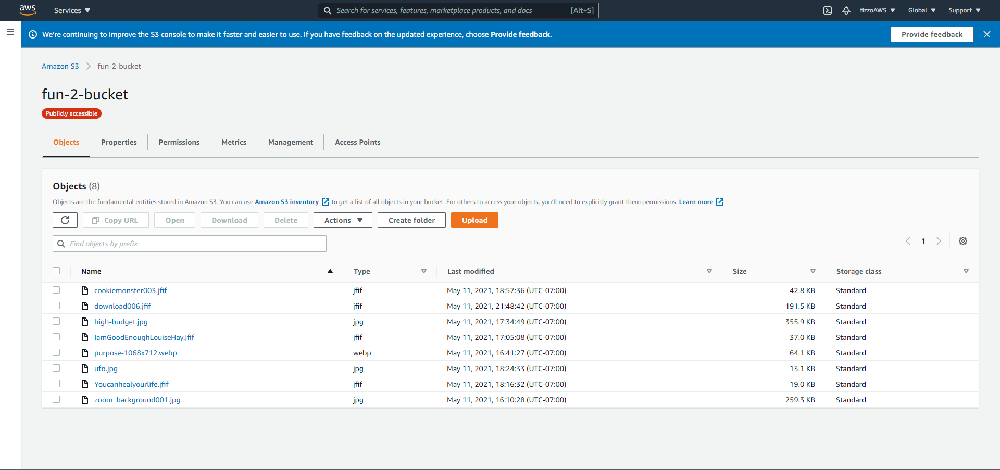
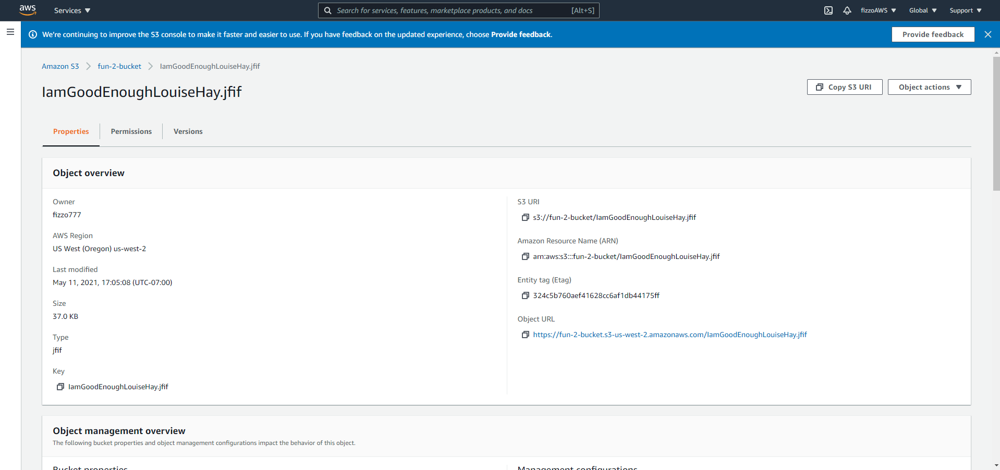
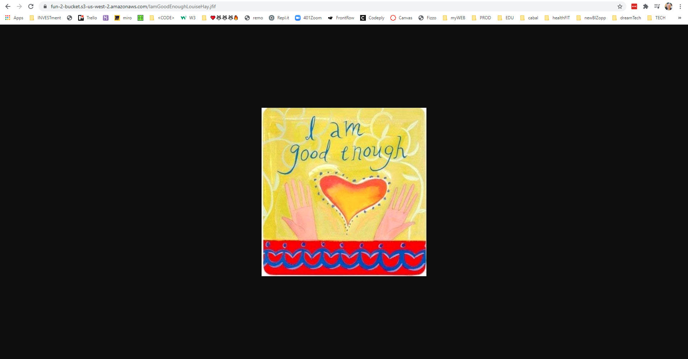
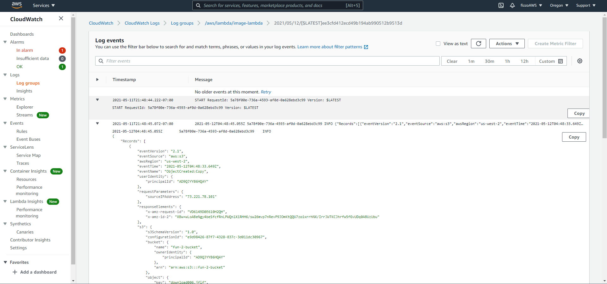

# image-lambda

AWS image array / dictionary

## resources

- [codota - aws - s3 listObjects](https://www.codota.com/code/javascript/functions/aws-sdk/S3/listObjects)

- [AWS documentation s3_listobjects.js](https://docs.aws.amazon.com/code-samples/latest/catalog/javascript-s3-s3_listobjects.js.html)

## Author: Fizzo Pannosch

**Version**: 1.0.0

<!-- (increment the patch/fix version number if you make more commits past your first submission) -->

### 
 links and resources 

<!--  -->

#### 
 [merged pull request - github](https://github.com/fizzo999/caps/pull/2) 

## 
 UML DIAGRAM 

#### Running the app

not sure how to explain this. I followed the steps from class this morning and I made it work for me - but since you actually have to log in to see this - not sure how to give you a peek other than some screen shots....

## Architecture

- s3 bucket with manually uploaded images

## Change Log

05-11-2021 11:00pm - Lambda function is working - and connected to fun-2-bucket on s3. AWS services and configured as a trigger on any object modification to run and import a list of all the objects in that folder/bucket.

## Credits and Collaborations

special shout out to Brendan Smith and Jarrell Houston for help with AWS Lambda

Number and name of feature: s3 bucket setup, lambda setup, many maany tests and uploads - implementation
Estimate of time needed to complete: 4 hours
Start time: 4:00 pm
Finish time: 12:00 pm
Actual time needed to complete: 8 hours
